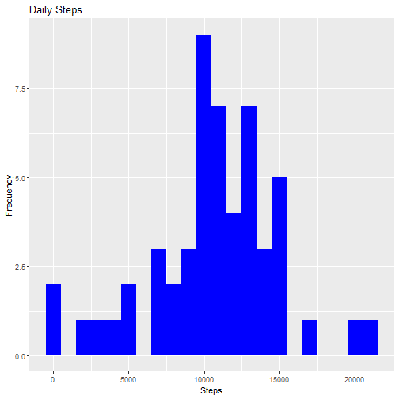
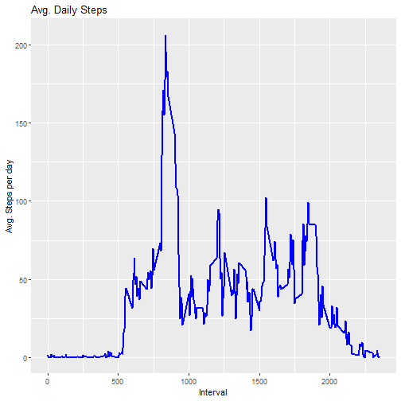
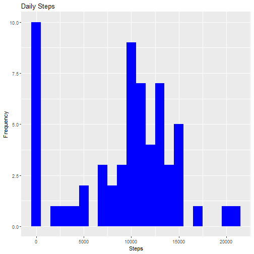
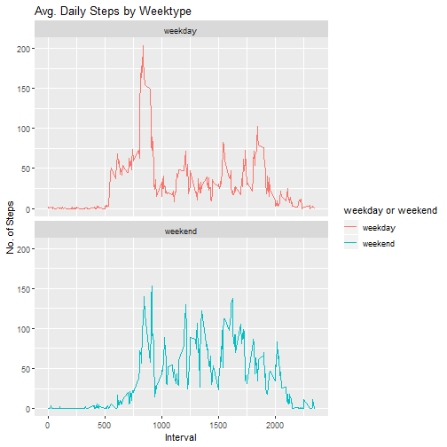

## [A] Loading and preprocessing the data


1. Loading the data

Since zipped file is already available in the forked repository, no need to download it again. We just need to unzip the file and load into R.


```r
unzip("activity.zip")
activityDT <- data.table::fread(input = "activity.csv")
```


The variable names and the structure of the file are given by


```r
names(activityDT)
```

```
## [1] "steps"    "date"     "interval"
```

```r
str(activityDT)
```

```
## Classes 'data.table' and 'data.frame':	17568 obs. of  3 variables:
##  $ steps   : int  NA NA NA NA NA NA NA NA NA NA ...
##  $ date    : chr  "2012-10-01" "2012-10-01" "2012-10-01" "2012-10-01" ...
##  $ interval: int  0 5 10 15 20 25 30 35 40 45 ...
##  - attr(*, ".internal.selfref")=<externalptr>
```


2. Removing rows with NAs.


```r
activityDT_wo_na <- activityDT[which(!is.na(activityDT$steps)), ]
head(activityDT_wo_na)		
```

```
##    steps       date interval
## 1:     0 2012-10-02        0
## 2:     0 2012-10-02        5
## 3:     0 2012-10-02       10
## 4:     0 2012-10-02       15
## 5:     0 2012-10-02       20
## 6:     0 2012-10-02       25
```


## [B] What is mean total number of steps taken per day?


1. Calculate the total number of steps taken per day


```r
Total_Steps <- activityDT[, c(lapply(.SD, sum, na.rm = FALSE)), .SDcols = c("steps"), by = .(date)]

summary(Total_Steps)
```

```
##      date               steps      
##  Length:61          Min.   :   41  
##  Class :character   1st Qu.: 8841  
##  Mode  :character   Median :10765  
##                     Mean   :10766  
##                     3rd Qu.:13294  
##                     Max.   :21194  
##                     NA's   :8
```


2. If you do not understand the difference between a histogram and a barplot, research the difference between them. 
Make a histogram of the total number of steps taken each day.


```r
library(ggplot2)
ggplot(Total_Steps, aes(x = steps)) +
    geom_histogram(fill = "blue", binwidth = 1000) +
    labs(title = "Daily Steps", x = "Steps", y = "Frequency")
```

```
## Warning: Removed 8 rows containing non-finite values (stat_bin).
```




3. Calculate and report the mean and median of the total number of steps taken per day.


```r
Total_Steps[, .(Mean_Steps = mean(steps, na.rm = TRUE), Median_Steps = median(steps, na.rm = TRUE))]
```

```
##    Mean_Steps Median_Steps
## 1:   10766.19        10765
```


## [C] What is the average daily activity pattern?

1. Make a time series plot (i.e. type = "l") of the 5-minute interval (x-axis) and the average number of steps taken, averaged across all days (y-axis)


```r
IntervalDT <- activityDT[, c(lapply(.SD, mean, na.rm = TRUE)), .SDcols = c("steps"), by = .(interval)] 

ggplot(IntervalDT, aes(x = interval , y = steps)) + geom_line(color="blue", size=1) + labs(title = "Avg. Daily Steps", x = "Interval", y = "Avg. Steps per day")
```



2. Which 5-minute interval, on average across all the days in the dataset, contains the maximum number of steps?


```r
IntervalDT[steps == max(steps), .(max_interval = interval)]
```

```
##    max_interval
## 1:          835
```


## [D] Imputing missing values

1. Calculate and report the total number of missing values in the dataset (i.e. the total number of rows with NAs) 


```r
   activityDT[is.na(steps), .N ]
```

```
## [1] 2304
```


2.Devise a strategy for filling in all of the missing values in the dataset. The strategy does not need to be sophisticated. 
  For example, you could use the mean/median for that day, or the mean for that 5-minute interval, etc.

Filling in missing values with median of dataset.


```r
  activityDT[is.na(steps), "steps"] <- activityDT[, c(lapply(.SD, median, na.rm = TRUE)), .SDcols = c("steps")]
```

3. Create a new dataset that is equal to the original dataset but with the missing data filled in.

   Above dataset is the output with missing data filled in.


4. Make a histogram of the total number of steps taken each day and calculate and report the mean and median total number of steps taken per day. Do these values differ from the estimates from the first part of the assignment? What is the impact of imputing missing data on the estimates of the total daily number of steps?

Total number of steps taken per day


```r
   Total_Steps <- activityDT[, c(lapply(.SD, sum)), .SDcols = c("steps"), by = .(date)] 
```


Mean and Median of total steps taken per day


```r
   Total_Steps[, .(Mean_Steps = mean(steps), Median_Steps = median(steps))]
```

```
##    Mean_Steps Median_Steps
## 1:    9354.23        10395
```
   
                     Mean_Steps     Median_Steps
                     
   First Part    :   10766.19       10765
   
   With NA filled:   9354.23        10395


Histogram of the total number of steps taken each day


```r
   ggplot(Total_Steps, aes(x = steps)) + geom_histogram(fill = "blue", binwidth = 1000) +     labs(title = "Daily Steps", x = "Steps", y = "Frequency")
```




## [E] Are there differences in activity patterns between weekdays and weekends?


1. Create a new factor variable in the dataset with two levels - "weekday" and "weekend" indicating whether a given date is a weekday or weekend day.


```r
activityDT[, date := as.POSIXct(date, format = "%Y-%m-%d")]
activityDT[, `Day of Week`:= weekdays(x = date)]
activityDT[grepl(pattern = "Monday|Tuesday|Wednesday|Thursday|Friday", x = `Day of Week`), "weekday or weekend"] <- "weekday"
activityDT[grepl(pattern = "Saturday|Sunday", x = `Day of Week`), "weekday or weekend"] <- "weekend"
activityDT[, `weekday or weekend` := as.factor(`weekday or weekend`)]
head(activityDT, 10)
```

```
##     steps       date interval Day of Week weekday or weekend
##  1:     0 2012-10-01        0      Monday            weekday
##  2:     0 2012-10-01        5      Monday            weekday
##  3:     0 2012-10-01       10      Monday            weekday
##  4:     0 2012-10-01       15      Monday            weekday
##  5:     0 2012-10-01       20      Monday            weekday
##  6:     0 2012-10-01       25      Monday            weekday
##  7:     0 2012-10-01       30      Monday            weekday
##  8:     0 2012-10-01       35      Monday            weekday
##  9:     0 2012-10-01       40      Monday            weekday
## 10:     0 2012-10-01       45      Monday            weekday
```


2. Make a panel plot containing a time series plot (i.e. type = "l") of the 5-minute interval (x-axis) and the average number of steps taken, averaged across all weekday days or weekend days (y-axis). See the README file in the GitHub repository to see an example of what this plot should look like using simulated data.


```r
activityDT[is.na(steps), "steps"] <- activityDT[, c(lapply(.SD, median, na.rm = TRUE)), .SDcols = c("steps")]
IntervalDT <- activityDT[, c(lapply(.SD, mean, na.rm = TRUE)), .SDcols = c("steps"), by = .(interval, `weekday or weekend`)] 

ggplot(IntervalDT , aes(x = interval , y = steps, color=`weekday or weekend`)) + geom_line() + labs(title = "Avg. Daily Steps by Weektype", x =    "Interval", y = "No. of Steps") + facet_wrap(~`weekday or weekend` , ncol = 1, nrow=2)
```


